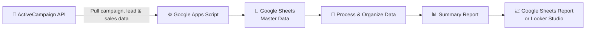

# 📊 Reporting & Analytics

Systems that give management clear visibility on demand — client reporting trackers, ad performance dashboards, and analytics pipelines.

[⬅ Back to Profile](https://github.com/mitchsanchez29) · [🔁 Business Automation](https://github.com/mitchsanchez29/business-automation) · [💰 Finance & Operations](https://github.com/mitchsanchez29/finance-operations)

---

## Featured Projects

| Project | Project Type |
|---------|--------------|
| [Client Reporting Management System](#Client-Reporting-Management-System) | 🏢 Work Project |
| [Facebook Ads Dashboard](#Facebook-Ads-Dashboard) | 🏢 Work Project |
| [Google Ads Dashboard](#Google-Ads-Dashboard) | 🏢 Work Project |
| [YouTube Analytics Reporting Pipeline](#YouTube-Analytics-Reporting-Pipeline) | 🏢 Work Project |
| [ActiveCampaign API Reporting Automation](#ActiveCampaign-API-Reporting-Automation) | 🏢 Work Project |
| [Closer and Setter Reporting Dashboard](#Closer-and-Setter-Reporting-Dashboard) | 🏢 Work Project |

---

## Client Reporting Management System

**Type:** WORK PROJECT

**Business Problem:** Managing weekly Facebook Ads and Google Ads reports across multiple clients by hand made it easy to miss a report, lose track of reporting history, or lose sight of which accounts were still active.

**Business Goal:** Give the team a single system to manage who needs a report, when it's due, and what's already been sent.

**My Solution:** A Google Sheets and Apps Script reporting system that automatically shows which clients are active for the week, tracks each report's status, logs completed reports, and rolls everything up into reporting analytics.

**Key Features:**
- Centralized **Client Overview** to track active and inactive accounts
- **This Week Reports** sheet that automatically shows only active clients
- Report status tracking (**Pending**, **In Progress**, **Done**) per client
- Automatic logging of completed reports to **Report Logs**
- Full reporting history per client: start week, latest completed week, total reports completed
- **Annual Analytics Dashboard** with monthly, yearly, and per-client summaries

**Screenshots**

| **Client Overview** | **This Week Reports** |
|---|---|
| | 
| **Report Logs** | **Annual Analytics Dashboard** |
|---|---|
|  | |

**Business Questions Answered:**
- Which clients still need their report this week?
- How many reports has each client received since we started working with them?

**Business Value:** No more missed reports, a clean audit trail of reporting history, and less time spent tracking who's done and who isn't.

**Tech Stack:** `Google Sheets` `Google Apps Script` `Google Workspace`

---

## Facebook Ads Dashboard

**Type:** WORK PROJECT

**Business Problem:** Facebook Ads performance data had no centralized view. Reporting was manual, slow, and inconsistent from week to week.

**Business Goal:** Give the marketing team a live, always-current view of ad performance without manual exports.

**My Solution:** A Looker Studio dashboard connected directly to Facebook Ads through an OAuth token and partner connector. The dashboard refreshes on its own and gives the team a real-time view of spend, reach, and results.

**Workflow**

**Key Features:**
- Facebook Ads connected via OAuth token + partner connector
- Live campaign metrics: spend, reach, CPM, CTR, results
- Auto-refreshing — no manual exports needed

**Screenshots**

| **Facebook Ads Manager** | **Looker Studio Dashboard** |
|---|---|
|  | |

**Business Questions Answered:**
- How is ad spend performing this week compared to last?
- Which campaigns are actually driving results?

**Business Value:** No more manual pulls from Ads Manager — the team checks one live dashboard instead of waiting on a report.

**Tech Stack:** `Facebook Ads API` `OAuth Token` `Partner Connector` `Looker Studio`

---

## Google Ads Dashboard

**Type:** WORK PROJECT

**Business Problem:** Google Ads and Analytics data had no structured reporting, which made it hard to quickly compare performance across different time periods.

**Business Goal:** Create one report that makes week-over-week, month-over-month, and year-to-date performance easy to compare at a glance.

**My Solution:** A multi-page Looker Studio dashboard connected to Google Analytics, giving clear and consistent reporting across WoW, MoM, and YTD views — all shareable as one PDF-ready report.

**Workflow**

**Key Features:**
- Connected to Google Analytics via native Looker Studio connector
- Week-over-Week, Month-over-Month, and Year-to-Date pages
- Shareable as PDF for client or management reporting

**Screenshots**

| **Page 1 — WoW Report** | **Page 2 — MoM Report** | **Page 3 — YTD Report** |
|---|---|---|
|  |  |  |

**Business Questions Answered:**
- Are we trending up or down compared to last week, last month, or last year?
- Which time period tells the clearest story for a client update?

**Business Value:** Faster, clearer performance conversations with clients or management — no rebuilding the comparison manually every time.

**Tech Stack:** `Google Ads` `Google Analytics` `Looker Studio` `Native Connector` `PDF Report`

---

## YouTube Analytics Reporting Pipeline

**Type:** WORK PROJECT

**Business Problem:** Channel performance data had to be checked manually instead of tracked over time.

**My Solution:** A daily automated pipeline that pulls data from the YouTube Analytics API, stores it in a Google Sheets data warehouse, and feeds a Looker Studio dashboard for channel performance tracking.

**Workflow**

**Screenshots**

**Business Questions Answered:**
- How is channel performance trending over time?

**Business Value:** Ongoing performance history instead of one-off manual checks, with a live dashboard for tracking trends.

**Tech Stack:** `YouTube Analytics API` `Apps Script` `UrlFetchApp` `Google Sheets` `Looker Studio`

---

## ActiveCampaign API Reporting Automation

**Type:** WORK PROJECT

**Business Problem:** Pulling ActiveCampaign campaign, lead, and sales data for reporting meant manual exports every time — and different clients wanted the numbers delivered in different formats.

**Business Goal:** Automate the data pull and let the reporting format flex per client, without adding manual work.

**My Solution:** Google Apps Script connects to the ActiveCampaign API, retrieves campaign, lead, and sales data, processes the JSON response, and automatically updates Google Sheets. For larger exports, the same pipeline also handles CSV files up to 156MB through chunked processing into a central Master Data sheet. Some clients prefer reports in Google Sheets instead of Looker Studio — the reporting format is built to match what each client actually wants.

**Screenshots:**

**Key Features:**
- Direct API connection to ActiveCampaign for campaign, lead, and sales data
- Automatic JSON processing into Google Sheets
- Handles large CSV exports (up to 156MB) via chunked processing when needed
- Flexible reporting delivery — Google Sheets or Looker Studio, based on client preference

**Screenshots**

| **📥 ActiveCampaign API Data** | **📊 Leads & Sales Summary** |
|--------------------------------|------------------------------|
|  |  |
| **API Data Import** – Lead and sales data are automatically pulled from the ActiveCampaign API and stored in Google Sheets. | **Summary Report** – Select a date range to instantly view total leads, total sales, and a daily breakdown for reporting.

**Business Questions Answered:**
- What's the current campaign, lead, and sales performance from ActiveCampaign?
- How is the reporting broken down for this specific client's preferred format?

**Business Value:** Eliminates manual exports, gets reports out faster, improves reporting accuracy, and gives clients the reporting format they actually want.

**Tech Stack:** `ActiveCampaign API` `Google Apps Script` `JSON` `Google Sheets` `Looker Studio`

---

## Closer and Setter Reporting Dashboard

**Type:** WORK PROJECT *(Team Project)*

**Business Problem:** Sales closer and setter data needed to be captured, cleaned, and reported daily — a manual process that was hard to keep consistent.

**My Solution:** Closers and setters submit end-of-day data through an Airtable Form. A Zapier integration (set up by the team) transfers submissions to Google Sheets.

**My Role:** Daily data monitoring, cleaning, structuring cash collected, payments, and commissions — then building and maintaining the Looker Studio performance report.

**Workflow**

**Screenshots**

 

**Business Questions Answered:**
- What did the team close and collect today?

**Business Value:** Clean, consistent daily sales data and a reliable performance report management could actually trust.

**Tech Stack:** `Airtable` `Zapier` `Google Sheets` `Looker Studio`

---

## Let's Connect

If you're looking for a simpler way to manage repetitive work, reporting, or business operations, let's talk about what could work for your team.

📧 **[Email](mailto:sanchezmitch77@gmail.com)**

💼 **[LinkedIn](https://www.linkedin.com/in/michelle29/)**

---

[⬅ Back to Profile](https://github.com/mitchsanchez29) · [🔁 Business Automation](https://github.com/mitchsanchez29/business-automation) · [💰 Finance & Operations](https://github.com/mitchsanchez29/finance-operations)

